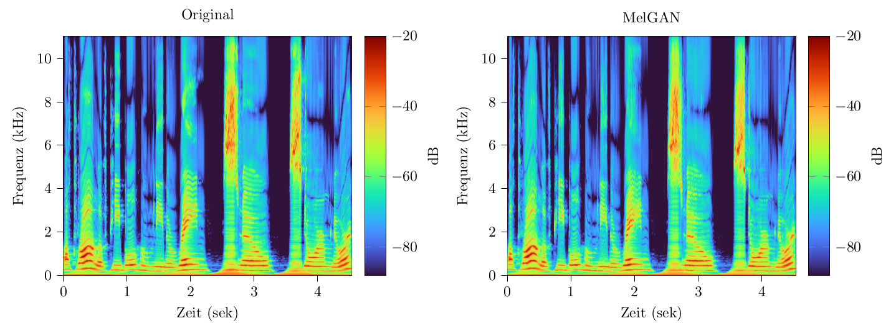

# Erkennung von Audiodeepfakes mithilfe von kontinuierlichen Wavelet-Transformationen

This is the supplementary source code for my bachelor thesis "[Erkennung von Audiodeepfakes mithilfe von kontinuierlichen Wavelet-Transformationen](https://github.com/gan-police/wavelet-audiodeepfake-detection_thesis)".



The plot above shows the scalograms (scale-time representation) of a real audio file (left) and the melgan generated
counterpart (right). In my thesis I compare the performance of cnn based classifiers for audio deepfake detection with the work of [Frank and Schönherr](https://github.com/RUB-SysSec/WaveFake).

## Installation

The latest code can be installed in development mode in a running installation of python 3.10 with:

```shell
git clone git@github.com:gan-police/wavelet-audiodeepfake-detection_code.git
```
Move to the repository with
```shell
cd wavelet-audiodeepfake-detection_code
```
and install all requirements with
```shell
pip install -r requirements.txt
```

## Assets

For continuous wavelet computations, I use the:
- [PyTorch-Wavelet-Toolbox: ptwt](https://github.com/v0lta/PyTorch-Wavelet-Toolbox)

We compare our approach to the DCT-LFCC/MFCC-method from:
- [WaveFake: A Data Set to Facilitate Audio DeepFake Detection](https://github.com/RUB-SysSec/WaveFake)

### Datasets

We utilize two datasets that appeared in previous work:

- [LJSpeech 1.1](https://keithito.com/LJ-Speech-Dataset/)
- [WaveFake](https://zenodo.org/record/5642694)

## Reproduction

The following section of the README serves as a guide to reproducing the experiments from my thesis.

### Preparation

As the WaveFake dataset contains gan generated audios equivalent to the audios of LJSpeech, no further preparation needs to be done to get all audios that are needed. We work with mono-channeled audios of different sizes. Hence, the raw audio needs to be cut into equally sized frames of desired size. We mainly used frames of 0.5s and 0.25s. The sample rate can be varied as well.

To do this store all images (original and GAN-generated) in separate subdirectories of one or two directories (depends if you split real and fake), i.e. the directory structure should look like this

```
data
  ├── fake
  │    ├── B_melgan
  │    |    ├── LJ001-0001_gen.wav
  |    |    ├── ...
  │    |    └── LJ008-0217_gen.wav
  │    └── C_hifigan
  │         ├── LJ001-0001_gen.wav
  |         ├── ...
  │         └── LJ008-0217_gen.wav
  └── real
       └── A_ljspeech
            ├── LJ001-0001.wav
            ├── ...
            └── LJ008-0217.wav
```

The prefixes of the folders are important, since the directories get the labels in lexicographic order of their prefix, i.e. directory `A_...` gets label 0, `B_...` label 1, etc.

Now, to prepare the data sets run `src.prepare_dataset` . It reads data set, splits them into a training, validation and test set, cuts all audios to pieces of window_size, resamples to the desired sample rate and stores the result as numpy arrays. This could look like this:

```shell
python -m src.prepare_datasets \
    --window-size 22050 \
    --sample-rate 22050 \
    --realdir "${HOME}/data/real/A_ljspeech" \
    --fakedir "${HOME}/data/fake/B_melgan" \
    --directory "${HOME}/data/fake"
```
or
```shell
python -m src.prepare_datasets \
    --window-size 22050 \
    --sample-rate 22050 \
    --realdir "${HOME}/data/real/A_ljspeech" \
    --directory "${HOME}/data/fake"
```

The dataset preparation script accepts additional arguments. For example, it is possible to change the sizes of the train, test or validation sets. For a list of all optional arguments, open the help page via the `-h` argument.

### Training the Classifier

Now you should be able to train a classifier using for example:

```shell
python -m src.train_classifier \
    --data-prefix "${HOME}/data/fake_22050_11025_0.7_melgan" \
    --batch-size 128 \
    --learning-rate 0.0001 \
    --weight-decay 0.0001   \
    --epochs 10 \
    --model "lcnn"  \
    --wavelet "cmor3.3-4.17" \
    --f-min 1000 \
    --features "none" \
    --hop-length 50 \
    --transform packets \
    --calc-normalization \
    --f-max 9500 \
    --num-of-scales 150 \
    --sample-rate 22050 \
    --flattend-size 352 \
    --pbar \
    --tensorboard
```

This trains a cnn classifier using the chosen hyperparameters. The training, validation and test accuracy and loss values are stored in a file placed in a `log` folder. The state dict of the trained model is stored there as well. Using the argument `--adapt-wavelet` will make the wavelet bandwidth and center frequency part of the trainable parameters of the model. For a list of all optional arguments, open the help page via the `-h` argument.

### Evaluating the Classifier

#### Calculating accuracy and equal error rate (EER)

To calculate the accuracy and eer of trained models use `src.eval_models` with varying arguments, e.g.
```shell
python -m src.eval_models \
    --data-prefix "${HOME}/data/fake_22050_11025_0.7" \
    --model-path-prefix ./log/fake_packets_none_100_22050_22050_256_1-11025_0.7_0.0001_0.01_64_2_10e_lcnn_False \
    --model "lcnn"  \
    --batch-size 64 \
    --window-size 22050 \
    --sample-rate 22050 \
    --flattend-size 352 \
    --features none \
    --seed 0 \
    --transform packets \
    --train-gans "melgan"
```

If you want to cross evaluate models against the test sets of other gans, you can use the `--crosseval-gans`, e.g. like this:
```shell
python -m src.eval_models \
    --data-prefix "${HOME}/data/fake_22050_11025_0.7" \
    --model-path-prefix ./log/fake_packets_none_100_22050_22050_256_1-11025_0.7_0.0001_0.01_64_2_10e_lcnn_False \
    --model "lcnn"  \
    --batch-size 64 \
    --window-size 22050 \
    --sample-rate 22050 \
    --flattend-size 352 \
    --features none \
    --seed 0 \
    --transform packets \
    --train-gans "melgan" \
    --crosseval-gans "melgan" "lmelgan" "mbmelgan" "fbmelgan" "hifigan" "waveglow" "pwg"
```
This evaluates the trained melgan model against all the other fake audios with default parameters, which makes it possible to see how well the classifier generalizes to other gan generated audios. All results will be saved in under `log/results/`.

For a list of all arguments, open the help page via the `-h` argument.


### Attributing the Classifier

To get a grip of which parts of the input the classifier uses to discriminate the audios in real and fake, I implemented attribution via integrated gradients. These can be used like this:
```shell
python -m src.integrated_gradients \
    --data-prefix "${HOME}/data/fake_22050_11025_0.7" \
    --plot-path "plots/attribution/" \
    --target-label 1 \
    --times 5056 \
    --model "learndeepnet"  \
    --wavelet "cmor3.3-4.17" \
    --num-of-scales 150 \
    --sample-rate 22050 \
    --flattend-size 21888 \
    --gans "melgan"
```
This plots the saliency, the integrated gradients and the mean over all time of the integrated gradients as min-, max- and absolute histograms for all given frequencies and saves the plots to latex standalone scripts.


## Issues
As we use a port of the Adam optimizer of the python module pytorch, we recommend to use torch 1.13.0, torchaudio 0.13.0 and cuda 11.

## Citation
This work is in the public domain. Feel free to use my material, but please cite it properly.
```
@misc{Gasenzer2023cwtaudiofreqdec,
  publisher = {Rheinische Friedrich-Wilhelms Universität Bonn.},
       year = {2023},
      title = {Erkennung von Audiodeepfakes mithilfe von kontinuierlichen Wavelet-Transformationen},
    address = {Bonn},
     author = {Gasenzer, Konstantin and Wolter, Moritz},
}
```
