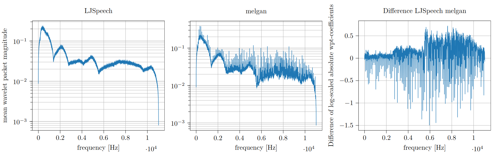

# Towards generalizing deep-audio-fake detection networks

This is the supplementary source code for our paper "[Towards generalizing deep-audio fake detection networks](https://arxiv.org/abs/2305.13033)".



The figure above shows our studies of stable frequency domain patterns created by the different GAN architectures.
The figure shows mean absolute level 14 Haar-Wavelet packet transform coefficients for LJSpeech and MelGAN audio files.
The transform reveals that MelGAN produces a spike-shaped pattern in the frequency domain.
We observe this for newer architectures like BigVGAN an Avocodo as well.

Further, by leveraging the wavelet-packet and short-time fourier transform, we train excellent lightweight
detectors that generalize well to unseen generators and examine the results in our paper.


## Assets

For wavelet computations, we use the:
- [PyTorch-Wavelet-Toolbox: ptwt](https://github.com/v0lta/PyTorch-Wavelet-Toolbox)

We compare our approach to the DCT-LFCC/MFCC-method from:
- [WaveFake: A Data Set to Facilitate Audio DeepFake Detection](https://github.com/RUB-SysSec/WaveFake)

### Datasets

We utilize two datasets that appeared in previous work and add our own extension:

- [LJSpeech 1.1](https://keithito.com/LJ-Speech-Dataset/)
- [WaveFake](https://zenodo.org/record/5642694)
- [Our Extension](https://zenodo.org/records/10512541)

### GAN Architectures
We utilize pre-trained models from the following repositories:

- [WaveFake](https://github.com/RUB-SysSec/WaveFake)
- [BigVGAN](https://github.com/NVIDIA/BigVGAN)

We used the inofficial implementation of Avocodo from [commit 2999557](https://github.com/ncsoft/avocodo) to train the avocodo vocoder.


## Fingerprint audios
We created an audible version of the mean spectra of the GAN fingerprints, by transforming them back into the time domain.
The folder `audio-samples/generator_artifacts/` contains sound files with amplified generator artifacts. The files are exciting but not 
aesthetically pleasing. We recommend listening at low volumes. Comparing `A_ljspeech_real.wav` with one of the GAN spectra
reveals clearly audible distinctions.

## Reproduction

The following section of the README serves as a guide to reproducing the experiments from our paper.

### Installation

The latest code can be installed in development mode in a running installation of python 3.10 or 3.11 with:

```shell
git clone git@github.com:gan-police/audiodeepfake-detection.git
```
Move to the repository with
```shell
cd audiodeepfake-detection
```
and install all requirements with
```shell
pip install -r requirements.txt
```

### Preparation WaveFake

As the WaveFake dataset contains gan generated audios equivalent to the audios of LJSpeech, no further preparation needs to be done to get all audios that are needed. We work with mono-channeled audios of different sizes. Hence, the raw audio needs to be cut into equally sized frames of desired size. We mainly used frames of 1s. The sample rate can be varied as well.

To do this store all audios (original and GAN-generated) in separate subdirectories, i.e. the directory structure should look like this

```
data
├── B_melgan
|    ├── LJ001-0001_gen.wav
|    ├── ...
|    └── LJ008-0217_gen.wav
├── C_hifigan
|    ├── LJ001-0001_gen.wav
|    ├── ...
|    └── LJ008-0217_gen.wav
.
.
.
├── K_lbigvgan
|    ├── LJ001-0001_gen.wav
|    ├── ...
|    └── LJ008-0217_gen.wav
└── A_ljspeech
     ├── LJ001-0001.wav
     ├── ...
     └── LJ008-0217.wav
```

The prefixes of the folders are important, since the directories get the labels in lexicographic order of their prefix, i.e. directory `A_...` gets label 0, `B_...` label 1, etc. If you skip certain letters in the alphabet that is okay as well. The labels will be in ascending order beginning from 0 automatically.

Now, to prepare the data sets set the `data_path` and `save_path` variable accordingly in `scripts.prepare_ljspeech` run `python -m scripts.prepare_ljspeech`. It reads the data set, cuts all audios to pieces of given size, splits them into a training, validation and test set, and stores the corresponding audio paths with the frame numbers for each audio as numpy arrays.
Use the parameter `use_only` to specify the name of the directories that should be used from the given data path. E.g. if there are directories `A_ljspeech`, `B_melgan` and `C_hifigan` but you only want to use the first two, set `only_use=["ljspeech", "melgan"]` in the corresponding dataset.

This process could take some time, because it reads the length of all audio files. The results will be saved in the directory specified in `save_path` and hence this process has to only run once for each dataset.

For reproduction, use following (symbolic) folder structure:
```
data
├── A_ljspeech
├── B_melgan
├── C_hifigan
├── D_mbmelgan
├── E_fbmelgan
├── F_waveglow
├── G_pwg
├── H_lmelgan
├── I_avocodo
├── J_bigvgan
├── K_lbigvgan
├── L_conformer
├── M_jsutmbmelgan
└── N_jsutpwg
```

### Training the Classifier

Now you should be able to train a classifier using the config file in `scripts/gridsearch_config.py` and the train scripts. The train scripts start the training process with some configuration values that can be changed. These will be loaded into a variable dict named `args` wich is dot accessible (e.g. `args.epochs`). If you run e.g. `scripts/train.sh` python will run `audiofakedetect.train_classifier` using the grid search functionality. In this case the given training parameters will be overridden if found in the config dict in `scripts/gridsearch_config.py`. There you can also define new training args if you want to use them later in a model or somewhere else in the code. Each parameter expects a list of values with `len(list) >= 1`. If you only give one value it will run only this one experiment. If you give more than one value the script will run two different experiments, one for each value. If you give more than one value for e.g. two parameters, the script will run `2 * 2 = 4` experiments.

Keep in mind that each experiment will be run for the several different seeds (default is 3 different seeds). If you provide `init_seeds` as config key, you can give a list of seeds, that will be used, e.g. `--init-seeds 0 1 2 3 4` for seeds 0-4.

Important: Set the `data_path`, `save_path`, `limit_train`, `cross_limit`, `seconds` the same as in `scripts/prepare_ljspeech.py`.

Using a cluster with slurm installed an examplary run for training the DCNN with a sym5 could be achieved by using the given config and executing

```bash
sbatch scripts/train.sh packets fbmelgan 256 sym5 2.0 False 320 1
```

### Evaluating the Classifier

#### Calculating accuracy and equal error rate (EER)

To test a model that was already trained, set the argument `only_testing` in the initial training script or in `scripts/gridsearch_config.py` to `True`.

#### Attribution using integrated gradients

To calculate the attribution using integrated gradients for a classifier, you first need to train the model using the above configuration. The config argument `only_ig` and `only_testing` must both be `False`. When training is finished, set the config argument `only_ig` to `True`. In `gridsearch_config.py` this would look like this: `"only_ig": [True]`. Further, set `"target": [0, 1, None],` to attribute the model for neuron 0 (real), neuron 1 (fake) and for None (both). This will create the following files in the log directory (set in `train.sh`):

```bash
log_dir/plots/some_model_config_[used-sources]x2500_target-0_integrated_gradients.npy
log_dir/plots/some_model_config_[used-sources]x2500_target-1_integrated_gradients.npy
log_dir/plots/some_model_config_[used-sources]x2500_target-01_integrated_gradients.npy
```

To plot the results, configure the variables in `plot_attribution` of `src/audiofakedetect/integrated_gradients.py` and execute it using `scripts/attribution.py`.


#### Example Misclassifications per Model

It is possible to extract misclassified audio fakes by comparing the correct classifications of different models. This can be done by using the `"get_details": [True]` config in your `gridsearch_config.py`. Set `"only_testing": [True]` as well if you have trained your models already. Using this configuration each test loop for each individual experiment will produce an output numpy file in the log dir with a file name starting with `true_ind...`.

To compare to experiment results (e.g. of a model with dilation and one without), use the `scripts/analyze_model_diffs.py` script to extract 10 sample audios which are correctly classified by the first given model and incorrectly classified by the second given model. You might need to adjust the corresponding file paths in the script to point to the result from the testing process and also specify a save path for the audios.

In the following we provide some examplary audios that were correctly classified as deep fake by our DCNN and misclassified (as real) by the same model without dilation:
- [B_melgan_LJ016-0433_gen_4.wav](audio-samples/classification_examples/B_melgan_LJ016-0433_gen_4.wav)
- [D_mbmelgan_LJ014-0293_gen_2.wav](audio-samples/classification_examples/D_mbmelgan_LJ014-0293_gen_2.wav)
- [H_lmelgan_LJ002-0228_gen_10.wav](audio-samples/classification_examples/H_lmelgan_LJ002-0228_gen_10.wav)
- [K_lbigvgan_LJ021-0060_generated_6.wav](audio-samples/classification_examples/K_lbigvgan_LJ021-0060_generated_6.wav)

## Building the documentation
To build the documentation move into `docs/` and install the requirements with 
```bash
pip install -r requirements.txt
```

Now you can run the makefile with

```bash
make html
```

You can finde the built version inside the `build/html/` folder.

## Issues
As we use the Adam optimizer of the python module pytorch, we recommend to use torch 2.0.0, torchaudio 2.0.0 and cuda 11.7.

Important: If training with multiple GPUs be aware of the train, test and val set sizes to be equal to our initial settings to get reproducible results.
When training and testing on different GPU hardware than our settings we cannot guarantee equal results.

## ⚖️ Licensing

This project is licensed under the [EUPL license](LICENSE).

## Acknowledgments

The research leading to the development of this dataset was supported by the Bundesministerium für Bildung und Forschung (BMBF) through the WestAI and BnTrAInee projects. The authors express their gratitude to the Gauss Centre for Supercomputing e.V. for funding the project and providing computing resources through the John von Neumann Institute for Computing (NIC) on the GCS Supercomputer JUWELS at Jülich Supercomputing Centre (JSC).

### Citation
If you use this work in a scientific context, please cite the following:
```
@article{gasenzerwolter2023generalizingadf,
      title={Towards generalizing deep-audio fake detection networks}, 
      author={Konstantin Gasenzer and Moritz Wolter},
      year={2023},
      eprint={2305.13033},
      archivePrefix={arXiv},
      primaryClass={cs.SD}
}
```
